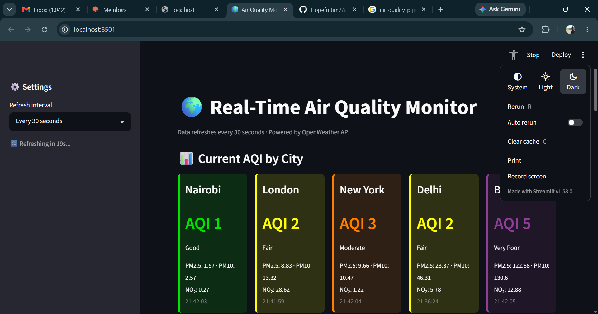
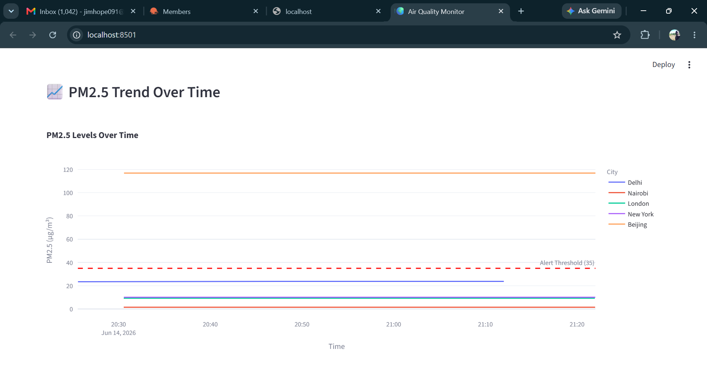
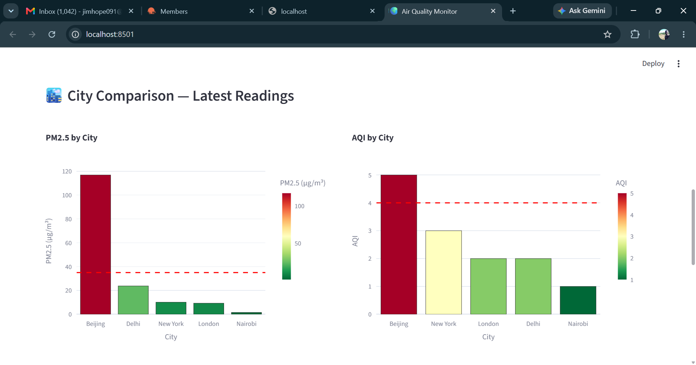
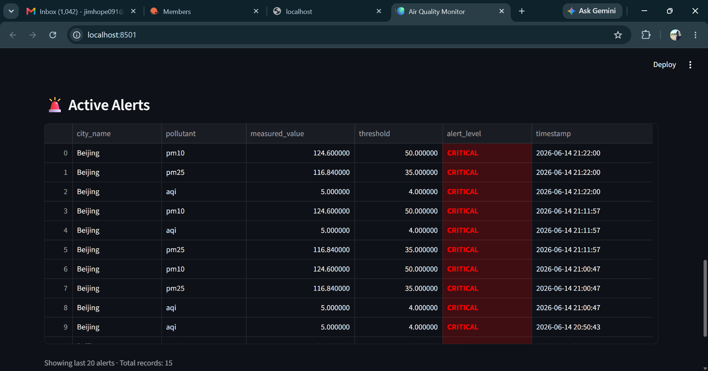
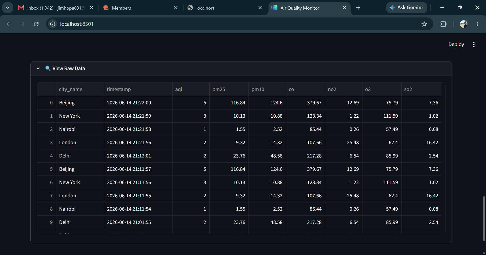

# 🌍 Real-Time Air Quality Monitoring Pipeline



A production-grade, end-to-end real-time data engineering pipeline that 
collects, processes, stores, and visualizes air quality data from 5 major 
cities across the globe — updated every 10 minutes using live data from 
the OpenWeather API.

---

## 🏥 Who This Helps

### Public Health Organizations & Ministries of Health
Real-time pollution monitoring enables early warning systems for vulnerable 
populations — children, the elderly, and those with respiratory conditions. 
Agencies can integrate this pipeline to trigger public health advisories 
automatically when AQI thresholds are exceeded.

### Environmental Protection Agencies
Continuous, automated data collection replaces manual monitoring with a 
scalable system that tracks PM2.5, PM10, NO₂, O₃, SO₂, and CO across 
multiple cities simultaneously — providing the evidence base for 
environmental policy decisions.

### Urban Planning & Smart City Initiatives
City planners can use historical trend data to correlate pollution spikes 
with traffic patterns, industrial activity, or weather events — informing 
decisions on zoning, green spaces, and transportation infrastructure.

### Research Institutions & Universities
The structured data warehouse (star schema) makes this pipeline ready for 
academic research — longitudinal studies on pollution trends, cross-city 
comparisons, and climate impact analysis.

### NGOs & Advocacy Groups
Transparent, publicly accessible air quality data empowers community 
advocacy. Organizations working on environmental justice can use this 
dashboard to document pollution disparities across cities and regions.

---

## 📊 Live Dashboard


*Real-time AQI cards with color-coded health categories for each city*


*PM2.5 concentration trends over time with alert threshold line*


*Side-by-side city comparison — PM2.5 and AQI bar charts*


*Real-time alert monitoring — CRITICAL and WARNING threshold violations*


*Complete raw data table with all pollutant readings*

---

## 🏗️ Architecture

OpenWeather API

↓

Python Producer (fetches every 10 min)

↓

Apache Kafka (air_quality_data topic)

↓

Apache Spark Structured Streaming (processes & validates)

↓

PostgreSQL (star schema data warehouse)

↓

Streamlit Dashboard (live visualization)

---

## 📡 Monitored Pollutants

| Pollutant | Description | Alert Threshold |
|-----------|-------------|-----------------|
| PM2.5 | Fine particulate matter | > 35 μg/m³ |
| PM10 | Coarse particulate matter | > 50 μg/m³ |
| NO₂ | Nitrogen Dioxide | > 100 μg/m³ |
| CO | Carbon Monoxide | — |
| O₃ | Ozone | — |
| SO₂ | Sulphur Dioxide | — |
| AQI | Air Quality Index (1–5) | > 4 |

---

## 🗄️ Data Model

### `dim_city`
| Column | Type | Description |
|--------|------|-------------|
| city_id | SERIAL PK | Unique city identifier |
| city_name | VARCHAR | City name |
| country | VARCHAR | Country code |
| latitude | NUMERIC | GPS latitude |
| longitude | NUMERIC | GPS longitude |

### `fact_air_quality`
| Column | Type | Description |
|--------|------|-------------|
| record_id | SERIAL PK | Unique record |
| city_id | INT FK | References dim_city |
| timestamp | TIMESTAMP | Reading time (UTC) |
| pm25, pm10, co, no2, o3, so2 | NUMERIC | Pollutant readings |
| aqi | INT | Air Quality Index |

### `fact_alerts`
| Column | Type | Description |
|--------|------|-------------|
| alert_id | SERIAL PK | Unique alert |
| city_id | INT FK | References dim_city |
| timestamp | TIMESTAMP | Alert time |
| pollutant | VARCHAR | Which pollutant triggered |
| threshold | NUMERIC | The threshold value |
| measured_value | NUMERIC | Actual reading |
| alert_level | VARCHAR | WARNING or CRITICAL |

---

## 🛠️ Technology Stack

| Layer | Technology |
|-------|-----------|
| Data Ingestion | Python 3.12, Requests |
| Message Streaming | Apache Kafka 3.4 |
| Stream Processing | Apache Spark 3.5.1 (PySpark) |
| Data Storage | PostgreSQL 15 |
| Visualization | Streamlit 1.58, Plotly |
| Containerization | Docker, Docker Compose |
| Data Source | OpenWeather Air Pollution API |

---

## 🚀 Getting Started

### Prerequisites
- Docker Desktop with WSL 2
- Python 3.12
- Java 11 (Temurin)
- OpenWeather API key (free tier)

### 1. Clone the repository
```bash
git clone https://github.com/YOUR_USERNAME/air-quality-pipeline.git
cd air-quality-pipeline
```

### 2. Set up environment variables
```bash
cp .env.example .env
# Edit .env and add your OpenWeather API key
```

### 3. Start infrastructure
```bash
docker compose up -d
```

### 4. Create Python environment
```bash
python -m venv venv
venv\Scripts\activate        # Windows
pip install -r producer/requirements.txt
pip install -r spark_processor/requirements.txt
pip install -r dashboard/requirements.txt
```

### 5. Create Kafka topic
```bash
docker exec -it kafka kafka-topics --create \
  --topic air_quality_data \
  --bootstrap-server localhost:9092 \
  --partitions 1 \
  --replication-factor 1
```

### 6. Run the pipeline (3 terminals)
```bash
# Terminal 1 — Producer
python producer/api_producer.py

# Terminal 2 — Spark Processor
python spark_processor/stream_processor.py

# Terminal 3 — Dashboard
streamlit run dashboard/app.py
```

---

## 📁 Project Structure

air-quality-pipeline/

│

├── docker-compose.yml          # Kafka, Zookeeper, PostgreSQL

├── .env.example                # Environment variable template

│

├── producer/

│   ├── api_producer.py         # Fetches API data, publishes to Kafka

│   └── requirements.txt

│

├── spark_processor/

│   ├── stream_processor.py     # Reads Kafka, processes, writes to PostgreSQL

│   └── requirements.txt

│

├── dashboard/

│   ├── app.py                  # Streamlit dashboard

│   └── requirements.txt

│

├── db/

│   └── init.sql                # Database schema and seed data

│

└── assets/                     # Dashboard screenshots

---

## 🌆 Cities Monitored

| City | Country | Coordinates |
|------|---------|-------------|
| Nairobi | Kenya 🇰🇪 | -1.29°, 36.82° |
| London | UK 🇬🇧 | 51.51°, -0.13° |
| New York | USA 🇺🇸 | 40.71°, -74.01° |
| Delhi | India 🇮🇳 | 28.61°, 77.21° |
| Beijing | China 🇨🇳 | 39.90°, 116.41° |

---

## 👤 Author

**Jim Hope**
Data Engineer | Medical Missionary | Êl's-Healing Ministry

*Built to support data-driven environmental health decisions 
in communities across Africa and beyond.*

---

## 📄 License

MIT License — free to use, adapt, and deploy for public good.