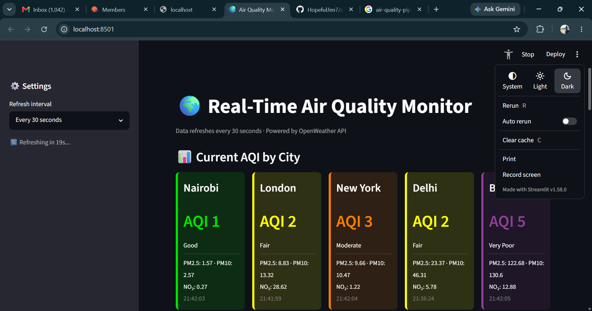
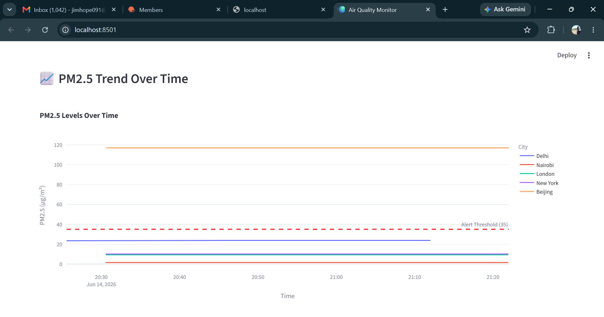
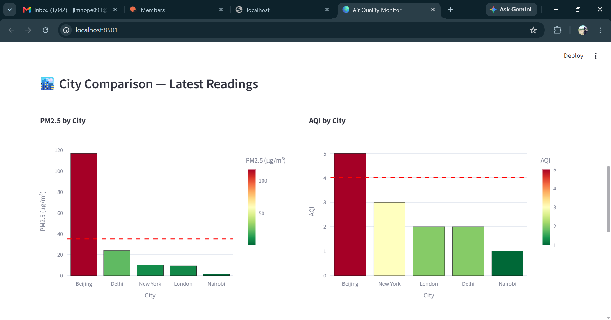
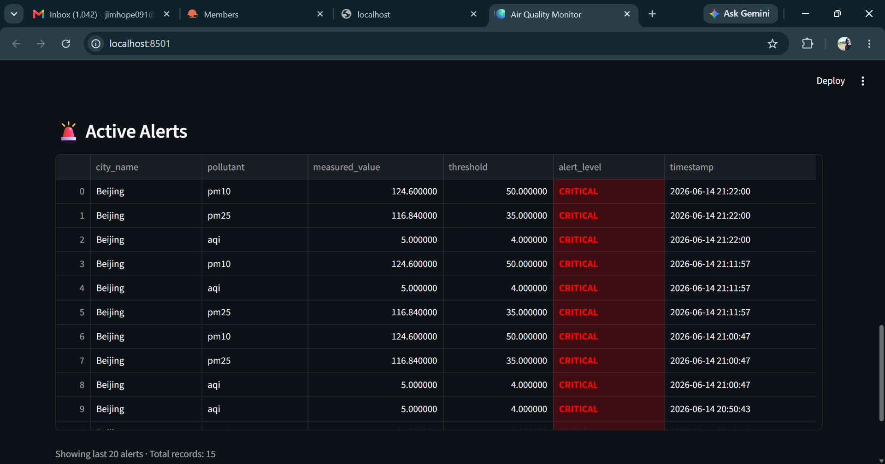
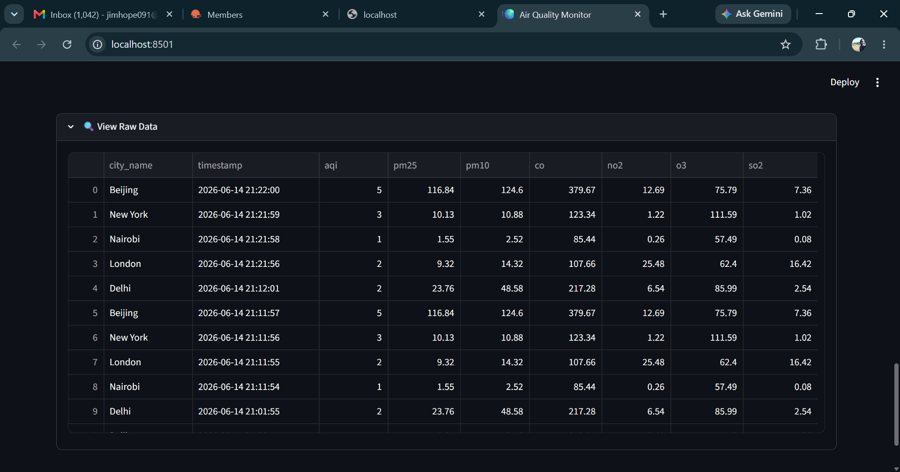

# Real-Time Air Quality Monitoring Pipeline

A production-grade, end-to-end real-time data engineering pipeline that
collects, processes, stores, and visualizes air quality data from 5 major
cities across the globe — updated every 10 minutes using live data from
the OpenWeather API.

---

## Who This Helps

### Public Health Organizations & Ministries of Health
Real-time pollution monitoring enables early warning systems for vulnerable
populations — children, the elderly, and those with respiratory conditions.
Agencies can integrate this pipeline to trigger public health advisories
automatically when AQI thresholds are exceeded.

### Environmental Protection Agencies
Continuous, automated data collection replaces manual monitoring with a
scalable system that tracks PM2.5, PM10, NO2, O3, SO2, and CO across
multiple cities simultaneously — providing the evidence base for
environmental policy decisions.

### Urban Planning & Smart City Initiatives
City planners can use historical trend data to correlate pollution spikes
with traffic patterns, industrial activity, or weather events — informing
decisions on zoning, green spaces, and transportation infrastructure.

### Research Institutions & Universities
The structured data warehouse (star schema) makes this pipeline ready for
academic research — longitudinal studies on pollution trends, cross-city
comparisons, and climate impact analysis.

### NGOs & Advocacy Groups
Transparent, publicly accessible air quality data empowers community
advocacy. Organizations working on environmental justice can use this
dashboard to document pollution disparities across cities and regions.

---

## Dashboard Screenshots

*Real-time AQI cards with color-coded health categories for each city*

*PM2.5 concentration trends over time with alert threshold line*

*Side-by-side city comparison — PM2.5 and AQI bar charts*

*Real-time alert monitoring — CRITICAL and WARNING threshold violations*

*Complete raw data table with all pollutant readings*

---

## Architecture